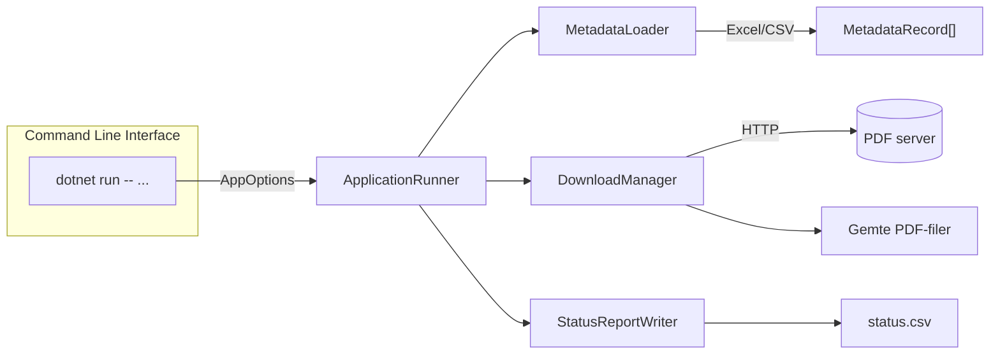

# PDF-Downloader – README

Robust og trådsikker .NET-applikation til at **downloade PDF-rapporter ud fra metadata i Excel eller CSV**.Projektet demonstrerer **multithreading, fejlhåndtering og fil-I/O**, og er baseret på en **realistisk kunde-case** fra Specialisterne.

> **Target Framework:** net9.0
> **Kerneservices:** ClosedXML, CsvHelper, System.Net.Http
> **Kørsel:** CLI / Console • Windows, macOS og Linux
> **Formål:** Stabil og hurtig bulk-download af rapporter med fallback-links og statusrapport.

---

## Funktioner

- Læser metadata fra **Excel (.xlsx)** og **CSV** via *ClosedXML* og *CsvHelper*
- Downloader PDF-filer fra kolonnerne `Pdf_URL` og `Pdf_URL_Alt`
- Fallback-logik: prøver sekundær URL hvis den primære fejler
- Parallelle downloads med konfigurerbar **MaxConcurrency**
- Automatisk navngivning efter kolonnen **BRNum**
- CSV-statusrapport (`status.csv`) med udfald og fejlbeskeder
- Fejltolerant – håndterer timeouts, ugyldige links og afbrydelser
- CLI-interface med mulighed for **limit** og **skip existing**

---

## Teknologier & Arkitektur

**Runtime & CLI**

- **.NET 9 Console App** (`Program.cs` → `ApplicationRunner`)
- Command-line parser (`AppOptions.cs`) med tydelig validering
- **CancellationToken** til Ctrl+C og clean shutdown

**Datahåndtering**

- **ClosedXML** – læser Excel-filer med headers og dynamiske kolonner
- **CsvHelper** – robust parsing af CSV-filer uden fast schema
- **MetadataLoader** – vælger automatisk korrekt parser (Excel/CSV)

**Multithreading**

- **DownloadManager** bruger `SemaphoreSlim` til at begrænse samtidige downloads
- **HttpClient** genbruges pr. instans (ingen socket leaks)
- **ConcurrentBag** til trådsikker opsamling af resultater

**Fejlhåndtering**

- Klare udfald (`Downloaded`, `SkippedExisting`, `Failed`, `NoUrl`)
- Detaljeret fejltekst (HTTP-kode, content-type, exception message)
- “Fallback retry” pr. URL-sæt og fortsættelse ved fejl

**Rapportering**

- **StatusReportWriter** genererer CSV-rapport med:
  `Id, Outcome, Message, SourceUrl, SavedFile`
- Fil-navne renses med `SanitizeFileName()` for gyldighed

---

## Arkitektur (forenklet)



---

## Projektstruktur

```text
Opgave 1 PDF Downloader/
├─ PDF Downloader.slnx
├─ README.md
├─ PDF Downloader/
│  ├─ Program.cs
│  ├─ appsettings.json
│  ├─ src/
│  │  └─ PdfDownloader.App/
│  │     ├─ ApplicationRunner.cs
│  │     ├─ AppOptions.cs
│  │     ├─ Middleware/
│  │     │  ├─ MetadataLoader.cs
│  │     │  └─ MetadataRecord.cs
│  │     ├─ Downloads/
│  │     │  ├─ DownloadManager.cs
│  │     │  ├─ DownloadRequest.cs
│  │     │  ├─ DownloadResult.cs
│  │     │  └─ DownloadOutcome.cs
│  │     └─ Reporting/
│  │        └─ StatusReportWriter.cs
│  ├─ Downloads/
│  │  ├─ status.csv
│  │  └─ status_GRI.csv
│  └─ samples/
│     ├─ Metadata2006_2016.xlsx
│     └─ GRI_2017_2020 (1).xlsx
└─ docs/
   ├─ kravspecifikation.md
   └─ uml-sekvensdiagram.md
```

---

## Kørsel & CLI

### Standard eksekvering

```bash
dotnet run --   --input "..\samples\Metadata2006_2016.xlsx"   --output ".\Downloads"   --status ".\Downloads\status.csv"   --id-column "BRnum"   --url-column "Pdf_URL"   --fallback-url-column "Pdf_URL_Alt"   --limit 10   --max-concurrency 5
```

### “Oh-shit moment” (fuld kørsel hjemme)

```bash
dotnet run --   --input "..\samples\GRI_2017_2020 (1).xlsx"   --output ".\Downloads"   --status ".\Downloads\status_full.csv"   --id-column "BRnum"   --url-column "Pdf_URL"   --fallback-url-column "Pdf_URL_Alt"   --limit 0   --max-concurrency 50
```

> 💡 Brug `Ctrl+C` for at afbryde. DownloadManager lukker trådsikkert ned via `CancellationToken`.

---

## Fejlhåndtering & Stabilitet

| Udfald                    | Forklaring                                     |
| ------------------------- | ---------------------------------------------- |
| **Downloaded**      | PDF gemt korrekt                               |
| **SkippedExisting** | Filen findes allerede                          |
| **Failed**          | Fejl (HTTP, IO, timeout, forkert content-type) |
| **NoUrl**           | Mangler gyldig URL i metadata                  |

- Hver fejl logges med årsag i `status.csv`
- Timeout = 120 sekunder pr. request
- Gyldige filnavne sikres via `SanitizeFileName`
- Ugyldige eller tomme URL’er springes over

---

## Concurrency og “Oh-shit moment”

Ved første test forsøgte systemet at starte **26.923 samtidige downloads** 😱
→ Resulterede i CPU-spikes og throttling-fejl.

**Løsningen**

- Introduceret **SemaphoreSlim** for max N samtidige downloads
- CLI-parameter `--max-concurrency` (1-32 standard)
- Stabilitet ved store dataset
- 50 samtidige tråde = ~100x hastighedsforbedring uden overload

---

## Statusrapport (CSV)

Eksempel (`status.csv`):

| Id    | Outcome         | Message            | SourceUrl   | OutputPath            |
| ----- | --------------- | ------------------ | ----------- | --------------------- |
| BR001 | Downloaded      |                    | https://... | ./Downloads/BR001.pdf |
| BR002 | Failed          | HTTP 404 Not Found | https://... |                       |
| BR003 | SkippedExisting | Allerede hentet    |             | ./Downloads/BR003.pdf |

---

## Versionshistorik

### 2025-10-06

- Første stabile version med fuld concurrency-styring
- Tilføjet statusrapport + fallback URL-logik
- Dokumenteret “oh-shit moment”
- Oprydning og kommentarer til alle klasser
- MetadataLoader implementeret (Excel/CSV)
- CLI parser (AppOptions) tilføjet
- Implementeret DownloadManager med HttpClient
- Projektstruktur og kravspecifikation etableret
- UML-diagram oprettet

---

## Designbeskrivelse & Begrundelser

- **Separation of Concerns** `MetadataLoader`, `DownloadManager` og `StatusReportWriter` har hver deres afgrænsede ansvar.
- **Concurrent design** `SemaphoreSlim` styrer parallelisme – balance mellem hastighed og netværksbelastning.
- **HttpClient reuse**Undgår socket-udmattelse og sikrer hurtig genbrug af forbindelser.
- **Fallback-logik**Prøver alternativ URL, hvis primær fejler – uden at stoppe hele processen.
- **Statusrapportering**CSV-fil gør det muligt at genoptage, fejlsøge og validere resultater efterfølgende.
- **Idempotent drift**
  Skip-existing logik muliggør sikre genkørsler.

---

## Fremtidige forbedringer

- **Logging til fil** (fx Serilog)
- **Exponential backoff** ved fejl eller timeouts
- **GUI-frontend** til monitorering
- **Resumér delvist hentede filer**
- **Parallel progressbar / CLI feedback**
- **Unit tests og mocks for HTTP-requests**

---

## Licens

Se `LICENSE` i roden af repoet.
