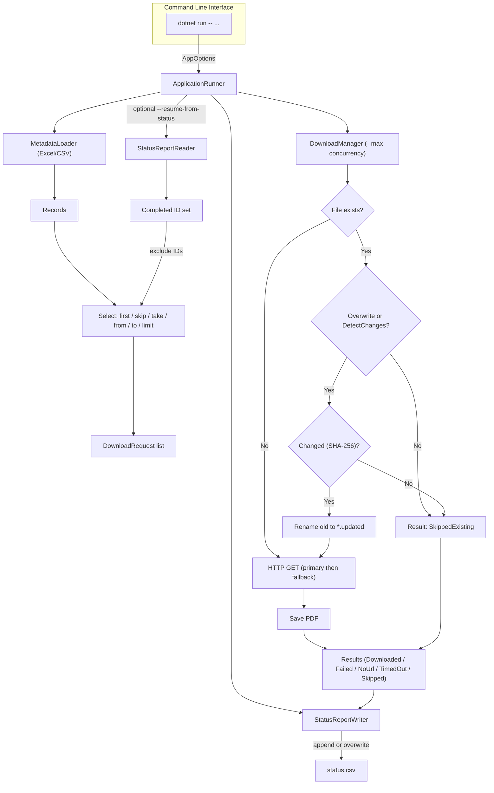

# PDF-Downloader – README

Robust, trådsikker og genoptagelig .NET-applikation til at **downloade PDF-rapporter ud fra metadata i Excel- eller CSV-filer**.  
Projektet demonstrerer **multithreading, fejlhåndtering, fil-I/O**, fleksibel **CLI-styring**, samt **automatiseret test og rapportering**.

> **Target Framework:** net9.0  
> **Kerneservices:** ClosedXML, CsvHelper, System.Net.Http  
> **Kørsel:** CLI / Console • Windows  
> **Formål:** Stabil, hurtig og genoptagelig bulk-download af rapporter med fallback-links, resume fra status, og fleksible filtreringsmuligheder.

---

## Indhold

- [Funktioner](#funktioner)  
- [Teknologier & Arkitektur](#teknologier--arkitektur)  
- [Arkitektur (forenklet)](#arkitektur-forenklet)  
- [Projektstruktur](#projektstruktur)  
- [Kørsel & CLI](#kørsel--cli)  
- [Fejlhåndtering & Stabilitet](#fejlhåndtering--stabilitet)  
- [Concurrency: resultater & anbefalinger](#concurrency-resultater--anbefalinger)  
- [Statusrapport (CSV)](#statusrapport-csv)  
- [Test & Coverage](#test--coverage)  
- [Automatiseret testrapportering (script)](#automatiseret-testrapportering-script)  
- [Designbeskrivelse & Begrundelser](#designbeskrivelse--begrundelser)  
- [Fremtidige forbedringer](#fremtidige-forbedringer)  
- [Versionshistorik](#versionshistorik)  
- [Licens](#licens)

---


## Funktioner

* 📑 **Indlæser metadata** fra **Excel (.xlsx)** og **CSV** via *ClosedXML* og *CsvHelper*.  
* 🌐 **Downloader PDF-filer** fra kolonnerne `Pdf_URL` og `Pdf_URL_Alt` med **automatisk fallback**.  
* ⚙️ **Konfigurerbar parallellisering** via `--max-concurrency` (styret af `SemaphoreSlim`) for balanceret netværksbelastning.  
* 🔁 **Resume fra tidligere kørsel** med `--resume-from-status` (springer allerede downloadede filer over).  
* 📊 **Statusrapport i CSV** (`status.csv`) med felterne **`Id, Outcome, Message, SourceUrl, SavedFile`** — kan **appendes** eller **overskrives** (`--append-status`, `--overwrite-status`).  
* 🎯 **Avanceret udvælgelse**: kør på et subset vha. `--first`, `--skip`, `--take`, `--from`, `--to`, `--limit`.  
* 🧠 **Change-detection & versionering** – **SHA-256** sammenligning; omdøb gamle filer til `*.updated.pdf` ved ændring (`--detect-changes`, `--keep-old-on-change`).  
* 🔒 **Idempotent drift** – sikre genkørsler via `--skip-existing` og/eller `--overwrite-downloads`.  
* 🧩 **Robust fejlhåndtering** – timeouts, ugyldige links, **HTTP 4xx/5xx**, content-type-fejl mm., uden at stoppe hele kørslen.  
* 🧾 **CLI-interface** med tydelig hjælpe-tekst (`AppOptions.Usage`).  
* 💾 **Automatisk filnavngivning** ud fra ID-kolonnen (fx `BRnum`).  
* 🧵 **Thread-safe design** og **HttpClient-genbrug** for stabil performance.  
* ⏱️ **Nye timeout-indstillinger**: total download-timeout, idle-timeout, connect-timeout og “ingen timeout”-mode.  
* 📜 **Run-log pr. kørsel** + **slot-statistik pr. tråd** for gennemsigtighed i concurrency.

---

## Teknologier & Arkitektur

**Runtime & CLI**

- **.NET 9 Console App** (`Program.cs` → `ApplicationRunner`)  
- **Command-line parser** (`AppOptions.cs`) med validering, defaults og usage‐tekst  
- Understøtter **resume**, **range-valg** og **status-kontrol**  
- **CancellationToken** til clean shutdown (Ctrl+C)

**Datahåndtering**

- **ClosedXML** – Excel med headers og case-insensitive kolonnenavne  
- **CsvHelper** – robust CSV parsing (læse/skrive)  
- **MetadataLoader** – vælger parser (Excel/CSV) og producerer `MetadataRecord[]`  
- **StatusReportReader** – læser både “færdige ID’er” og *alle* rækker robust  
- **StatusReportWriter** – skriver status CSV (append/overwrite)

**Multithreading & Ydelse**

- **DownloadManager** med `SemaphoreSlim` (`--max-concurrency`)  
- **HttpClient** genbruges; `SocketsHttpHandler` med HTTP/2, auto-decompression, `ConnectTimeout`  
- **Asynkron I/O** og `ConcurrentBag` til trådsikre resultater  
- **Slot-statistik** pr. “arbejder” (jobs/total/avg)

**Timeouts**

- `--download-timeout hh:mm:ss` (total pr. fil)  
- `--idle-timeout hh:mm:ss` (afbryd ved inaktiv download i X tid)  
- `--connect-timeout hh:mm:ss` (TCP/TLS handshake)  
- `--no-timeout` (overstyrer og kører uden tidsgrænse)  
- Nyt outcome **`TimedOut`** i status og log

**Fejlhåndtering & Robusthed**

- Klare udfaldstyper (`Downloaded`, `SkippedExisting`, `Failed`, `NoUrl`) via `DownloadOutcome`-enum
- Detaljerede fejlmeddelelser (HTTP-status, Content-Type, Exception message)
- **Fallback-strategi** – sekundær URL prøves automatisk, hvis den primære fejler
- Hver URL-gruppe håndteres isoleret – fejl på ét link stopper ikke de øvrige
- Intern `try/catch` sikrer fortsat kørsel, selv ved delvise fejl eller afbrud

--

## Arkitektur (forenklet)



---

## Projektstruktur

```text
Legend (kort): 📁 mappe • 🧩 C#-kode • ⚙️ config/json • 🪪 .sln/.csproj • 🧾 README/MD • 📑 CSV • 📊 Excel

📁 Opgave 1 PDF Downloader/
├─ 🪪 PDF Downloader.slnx
├─ 🧾 README.md
├─ 📁 PDF Downloader/
│  ├─ 🧩 Program.cs
│  ├─ 🪪 PDF Downloader.csproj
│  ├─ 📁 src/
│  │  └─ 📁 PdfDownloader.App/
│  │     ├─ 🧩 ApplicationRunner.cs
│  │     ├─ 🧩 AppOptions.cs 
│  │     ├─ 📁 Middleware/
│  │     │  ├─ 🧩 MetadataLoader.cs
│  │     │  └─ 🧩 MetadataRecord.cs
│  │     ├─ 📁 Downloads/
│  │     │  ├─ 🧩 DownloadManager.cs  
│  │     │  ├─ 🧩 DownloadRequest.cs
│  │     │  ├─ 🧩 DownloadResult.cs
│  │     │  └─ 🧩 DownloadOutcome.cs
│  │     └─ 📁 Reporting/
│  │        ├─ 🧩 StatusReportWriter.cs  
│  │        └─ 🧩 StatusReportReader.cs  
│  ├─ 📁 Downloads/
│  │  ├─ 📑 status.csv
│  │  └─ 📑 status_GRI.csv
│  └─ 📁 samples/
│     ├─ 📊 Metadata2006_2016.xlsx
│     └─ 📊 GRI_2017_2020 (1).xlsx
├─ 📁 tests/PdfDownloader.Tests/ (xUnit + fakes) (se ./docs/Readme for Test.md)
├─ 📁 docs/
│  ├─ 🧾 kravspecifikation.md
│  ├─ 🧾 uml-sekvensdiagram.md
│  ├─ 🧾 Concurrency.md
│  └─ 📁 test-reports/<yyyy-MM-dd_HHmmss>/
└─ 📁 scripts/
   └─ 🧾 testReport.ps1

```

---

## Kørsel & CLI

### Hurtig start

```bash
dotnet run --   --input ".\samples\Metadata2006_2016.xlsx"   --output ".\Downloads"   --status ".\Downloads\status.csv"   --id-column "BRnum"   --url-column "Pdf_URL"   --fallback-url-column "Pdf_URL_Alt"   --limit 10   --max-concurrency 5
```

### Fuld kørsel (stor datasæt + timeouts)

```bash
dotnet run --   --input ".\samples\GRI_2017_2020 (1).xlsx"   --output ".\Downloads"   --status ".\Downloads\status_full.csv"   --id-column "BRnum"   --url-column "Pdf_URL"   --fallback-url-column "Pdf_URL_Alt"   --limit 0   --max-concurrency 50   --download-timeout 00:01:00   --idle-timeout 00:01:00   --connect-timeout 00:00:10
```

> 💡 **Ctrl+C** afbryder sikkert. DownloadManager håndterer clean shutdown via `CancellationToken`.

### Udvalgte CLI-flag (oversigt)

| Flag | Beskrivelse | Default |
|---|---|---|
| `--input` / `--output` / `--status` | Kilde, outputmappe og status-CSV | – |
| `--id-column` / `--url-column` / `--fallback-url-column` | Kolonnenavne (case-insensitive i Excel) | `BRnum` / `Pdf_URL` / (valgfri) |
| `--max-concurrency` | Samtidige downloads (≥1) | `10` |
| `--limit` | Behandl kun første *N* rækker (0 = alle) | `0` |
| `--resume-from-status` | Læs tidligere `Downloaded`-ID’er og skip dem | – |
| `--append-status` / `--overwrite-status` | Append eller overskriv status-CSV (gensidigt udelukkende) | **append** som default |
| `--skip-existing` / `--no-skip-existing` | Skip eksisterende filer, hvis ikke overskrivning | `--skip-existing` |
| `--overwrite-downloads` | Hent igen selv hvis fil findes | off |
| `--detect-changes` | SHA-256 compare ved genkørsel | off |
| `--keep-old-on-change` | Gem gammel fil som `*.updated.pdf` ved ændring | off (impl. on ved `--overwrite-downloads`) |
| `--first/--skip/--take/--from/--to` | Række-udvalg/segmentering | – |
| `--download-timeout` | Total pr. fil | `00:02:00` |
| `--idle-timeout` | Afbryd ved inaktivitet | `00:00:15` |
| `--connect-timeout` | TCP/TLS handshake | `00:00:10` |
| `--no-timeout` | Kør uden tidsgrænser (overstyrer ovenstående) | off |

---

---

## Fejlhåndtering & Stabilitet

| Outcome | Forklaring |
|---|---|
| **Downloaded** | PDF gemt korrekt |
| **SkippedExisting** | Filen findes allerede / uændret |
| **Failed** | Fejl (HTTP, IO, forkert content-type, m.m.) |
| **NoUrl** | Mangler gyldig URL i metadata |
| **TimedOut** | Afbrudt pga. timeout (download/idle) |

- Fejl logges med årsag i `status.csv` (HTTP-kode, `Content-Type: ...`, `Exception: ...`, `Timeout` m.m.).  
- Filnavne renses (`SanitizeFileName`) for gyldige OS-navne.  
- Acceptér **`application/pdf`** og **`application/octet-stream`** som PDF; HTML mv. afvises.

---

## Concurrency: resultater & anbefalinger

**Kort** (fra `docs/Concurrency.md`, datasæt 2000 rækker):

- Tid fra **79:17.656** (1×) → **01:40.852** (100×) ≈ **47.17×** hurtigere.  
- Bedst “bang-for-buck” ved **32–50** samtidige. Over 50 giver mindre marginal gevinst og mere overhead.  
- Workloaden er **netværks-/server-begrænset**, ikke CPU-begrænset; “lang hale” styres af **timeouts**.

**Anbefalet default:** `--max-concurrency 32` eller `50` afhængigt af mål (effektivitet vs. kortest væg-til-væg tid).

> Se fuld tabel, noter og forklaringer i **`docs/Concurrency.md`**.

---

## Statusrapport (CSV)

Felter: **`Id, Outcome, Message, SourceUrl, SavedFile`**

Eksempel:

| Id    | Outcome         | Message            | SourceUrl   | SavedFile                    |
|-------|-----------------|--------------------|-------------|------------------------------|
| BR001 | Downloaded      |                    | https://... | .\Downloads\BR001.pdf        |
| BR002 | Failed          | HTTP 404 Not Found | https://... |                              |
| BR003 | SkippedExisting | No change detected |             | .\Downloads\BR003.pdf        |

---

## Statusrapport (CSV)

Eksempel (`status.csv`):

| Id    | Outcome         | Message            | SourceUrl   | OutputPath            |
| ----- | --------------- | ------------------ | ----------- | --------------------- |
| BR001 | Downloaded      |                    | https://... | ./Downloads/BR001.pdf |
| BR002 | Failed          | HTTP 404 Not Found | https://... |                       |
| BR003 | SkippedExisting | Allerede hentet    |             | ./Downloads/BR003.pdf |

---

## Test & Coverage

- **xUnit** tests: **18** (Unit + Integration)  
- **Resultat:** Passed **18/18**, Failed **0**, Skipped **0**  
- **Code coverage (line):** ~**84%**  
- Artefakter (eksempel): `.\docs	est-reports\<yyyy-MM-dd_HHmmss>\`
  - `coverage.cobertura.xml`  
  - `test.trx`  
  - `status-serial.csv`, `status-parallel.csv` (live mini-kørsler)  
  - `Run.log` (kørselslog)  
  - `TestReport.md` (genereret rapport)

Kør manuelt:

```bash
dotnet test .	ests\PdfDownloader.Tests\PdfDownloader.Tests.csproj -c Release
```

---

## Automatiseret testrapportering (script)

Krav: **.NET 9 SDK** og PowerShell.

Generér end-to-end testrapport inkl. mini-liveprøver (seriel vs. parallel), TRX, Cobertura og status-CSV’er:

```powershell
powershell -ExecutionPolicy Bypass -File ".\scripts	estReport.ps1"
```

Scriptet:
- bygger løsning og tests,  
- kører tests m. **XPlat Code Coverage** (Cobertura),  
- udfører to “live” mini-kørsler (`--limit 20`) med **1×** og **5×** concurrency,  
- samler alt i `docs/test-reports/<timestamp>/` inkl. **TestReport.md** og **Run.log**.

---

## Designbeskrivelse & Begrundelser

- **Separation of Concerns**: `MetadataLoader`, `DownloadManager`, `StatusReportReader/Writer`, `ApplicationRunner`.  
- **Concurrent design**: `SemaphoreSlim` begrænser samtidige downloads.  
- **HttpClient reuse**: én handler/klient pr. kørsel (undgår socket-udmattelse).  
- **Resume & filtrering**: fleksible flags til præcis rækkeudvælgelse og genoptag.  
- **Statusrapportering**: append/overwrite + audit-trail for fejlsøgning og sikre genstarter.  
- **Change detection & versionering**: SHA-256 + `*.updated.pdf`.  
- **Fallback-logik**: primær → sekundær URL uden at stoppe pipeline.  
- **Robusthed**: fejl isoleres pr. URL; Ctrl+C håndteres pænt.

---

## Fremtidige forbedringer

- **Retry-policy** (Polly) med **exponential backoff + jitter** for 5xx/timeout.  
- **Per-host rate-limit/fairness** (maks X samtidige pr. domæne).  
- **Adaptive concurrency** baseret på latenser/fejlrater.  
- **Struktureret logging** (Serilog/ILogger) + metrics.  
- **ETag/If-Modified-Since** for at undgå unødige downloads.  
- **Checksums-manifest** og udvidet resume-politik.  
- **TUI/CLI-UI** (Spectre.Console) m. progress.  
- **CI/CD** (GitHub Actions) med build/test/publish.

---

## Versionshistorik

### 2025-10-17
- Dokumentation for concurrency opdateret (**`docs/Concurrency.md`**).  
- README konsolideret med test, coverage, timeouts og logning.

### 2025-10-15 og 16
- **Timeouts tilføjet**: `--download-timeout`, `--idle-timeout`, `--connect-timeout`, `--no-timeout`.  
- Nyt outcome **`TimedOut`** + opdateret status/logik.  
- **Run-log** pr. kørsel + **slot-statistik** i log.  
- **StatusReportReader.ReadAll** gjort robust over for header-ændringer.  
- Testsuite udvidet til **18** tests; coverage ~**84%**.  
- Oprydning i statusfiler og forbedringer i concurrency-koden.

### 2025-10-06
- Første stabile version med fuld concurrency-styring.  
- Fallback-URL, statusrapport, resume, SHA-256 change detection.  
- CLI-parser (`AppOptions`) og pipeline (`ApplicationRunner`).  
- Kravspecifikation + UML + README.

---

## Licens

Se `LICENSE` i roden af repoet.

---

**Kendte forhold ved “live data”**  
Ved kørsel på ældre/eksterne links ses naturligt mange **404/403/HTML** og **timeouts**. Det er **datakvalitet/tilgængelighed** hos kilderne – ikke programfejl. Brug `--limit`, `--max-concurrency`, og timeouts for kontrollerede test, eller anvend et kurateret testsæt.
