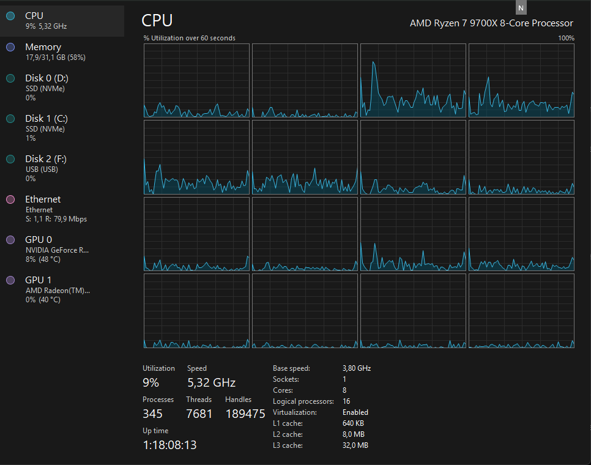

# Concurrency-resultater for PDF Downloader

**Maskine:** AMD Ryzen 7 5825U (8 kerner / 16 tråde) @ ~2.0 GHz • 16 GB RAM • 512 GB SSD
**Server Maskine:** AMD Ryzen 7 97 00X (8 kerner / 16 tråde) @ 3.8 (boost ~5.31) GHz • 32 GB RAM • 1024 GB M2.2280 NVMe SSD
**Datasæt:** 2000 rækker (2006–2016)
**Server Timeout** 60 s pr. anmodning
**Idle Timeout:** 60 s pr. anmodning
**Connect Timeout** 10 s pr. anmodning
**Download Timeout** 60 s pr. anmodning
**HTTP-klient:** Genbrugt `HttpClient`, parallelisering via `SemaphoreSlim`

---

## Målte køretider

Test parameter

```bash
dotnet run -- \
  --input "..\samples\Metadata2006_2016.xlsx" \
  --output ".\Downloads" \
  --status ".\Downloads\status_test2000.csv" \
  --id-column "BRnum" \
  --url-column "Pdf_URL" \
  --fallback-url-column "Pdf_URL_Alt" \
  --limit 2000 \
  --max-concurrency x \
  --download-timeout 00:01:00 \
  --idle-timeout 00:01:00
```

- Concurrency reducerer testtiden kraftigt: fra **79:17.656** (1×) til **01:40.852** ved **100** samtidige (≈ **47.17×** hurtigere).
- Den bedste *bang-for-buck* ligger omkring **32–50** samtidige downloads. Herefter er gevinsten relativt lille.

| Samtidige downloads | Tid (mm:ss:mmm) | Tid (sekunder) | Speedup vs. 1× | **Effektivitet ift. 1×** | Tid Server PC<br />(mm:ss:mmm) |
| ------------------: | :-------------: | -------------: | --------------: | ------------------------------: | ------------------------------ |
|                   1 |    79:17:656    |       4757.656 |          1,00× |                    **0%** |                                |
|                   2 |    45:30:962    |       2730.962 |          1.74× |                 **13 %** | 41:17:827                      |
|                   4 |    21:22:729    |       1282.729 |          3.71× |                   **7 %** | 21:51:332                      |
|                   8 |    10:31:292    |        631.292 |          7.54× |                   **6 %** | 11:27:622                      |
|                  16 |    05:41:356    |        341.356 |         13.94× |                  **13 %** | 05:46:653                      |
|                  32 |    03:16:299    |        196.299 |         24.24× |                  **24 %** | 03:22:674                      |
|                  50 |    02:29:727    |        149.727 |         31.78× |                  **36 %** | 02:34:039                      |
|                 100 |    01:40:852    |        100.852 |         47.17× |                  **53 %** | 01:45:194                      |

**Bemærk om effektivitet**

* Effektivitet (%) er *parallel-effektivitet relativt til 1 tråd* (baseline).
* **Formel:**`Effektivitet = (Speedup / Concurrency) × 100 = (T₁ / Tₙ / n) × 100`
  hvor `T₁` er tiden ved 1 tråd, `Tₙ` er tiden ved `n` tråde.
* **Overhead** i tabellen er blot `100% − effektivitet`.
* **Eksempler:** 8 tråde → speedup 7.54× ⇒ 7.54/8 = **94%** (overhead 6%).
  32 tråde → 24.24× ⇒ **76%** (overhead 24%).
  100 tråde → 47.17× ⇒ **47%** (overhead 53%).

**Observationer:**

- Største fald i tid ses fra 1 → 8 tråde (**79:17 → 10:31**).
- Omkring **32–50** tråde nærmer vi os den praktiske bund (**~3:16 → 2:29**).
- Yderligere øgning til 100 tråde giver stadig forbedring (**2:29 → 1:40**), men effektiviteten falder (fra **64%** til **47%**).

## Konklusionsbokse pr. concurrency

> **100 tråde**
> **Tid:** 01:40.852 (Arbejds) • 01:45.194 (Server)
> **Effektivitet:** 47% (Overhead 53%)
> **Note:** Maksimal throughput, men tydelig netværks-/serverbegrænsning og flere timeouts/403. Brug ved kortest mulig væg-til-væg tid.

> **50 tråde**
> **Tid:** 02:29.727 • 02:34.039
> **Effektivitet:** 64% (Overhead 36%)
> **Note:** God balance; kun lidt langsommere end 100×, men mere stabil log og færre server-hikke.

> **32 tråde**
> **Tid:** 03:16.299 • 03:22.674
> **Effektivitet:** 76% (Overhead 24%)
> **Note:** Sweet spot ift. effektivitet. God kandidat til default i produktion.

> **16 tråde**
> **Tid:** 05:41.356 • 05:46.685
> **Effektivitet:** 87% (Overhead 13%)
> **Note:** Meget effektivt, men væsentlig længere væg-til-væg tid.

> **8 tråde**
> **Tid:** 10:31.292 • 11:27.622
> **Effektivitet:** 94% (Overhead 6%)
> **Note:** Næsten ideel parallel-effektivitet; viser hvor I/O‑bound workloaden er.

> **4 tråde**
> **Tid:** 21:22.729 • 21:51.332
> **Effektivitet:** 93% (Overhead 7%)

> **2 tråde**
> **Tid:** 45:30.962 • **TBD**
> **Effektivitet:** 87% (Overhead 13%)

> **1 tråd (baseline)**
> **Tid:** 79:17.656 • **TBD**
> **Effektivitet:** 100% (Overhead 0%)

## CPU brug over tid (Server PC)

> Snapshot fra Task Manager viser lav CPU-udnyttelse på Ryzen 7 9700X under testen — workloaden er netværks-/server‑begrænset, ikke CPU‑begrænset.



---

## Hvorfor er speedup ikke lineær?

> Kort svar: fordi arbejdet ikke er 100 % parallelt, og fordi den “langsomme hale” (timeouts/fejl) sætter et gulv for total-tiden.

**1) Amdahl’s Law / ikke-parallel del**
Selv om mange downloads kan køre samtidigt, er der sektioner der ikke kan paralleliseres: læsning af metadata, log-/statusskrivning, planlægning mv. Den ikke-parallelle andel begrænser maksimal speedup.

**2) “Lang hale” i netværket**
En del links fejler hurtigt (404/403/301/HTML osv.), men nogle hænger i op til **60 s timeout**. Selvom 90 % af opgaverne bliver færdige hurtigt med høj concurrency, skal total-kørslen stadig vente på de langsomste resterende opgaver. Det skaber et naturligt **gulv ≈ timeout + overhead**.

**3) Server-throttling og fejlkoder**
Mange links går til få domæner, som kan begrænse forbindelser (rate limits) eller svare med fejlkoder. Mere concurrency lokalt hjælper ikke mod fjernservernes grænser – det kan endda udløse flere 403/429/5xx.

**4) Overhead og contention**
Flere samtidige forbindelser betyder mere TLS-håndtryk, flere sockets og flere kontekstskift. Det koster CPU/IO-overhead. På min maskine er CPU ikke flaskehalsen, men overheaden æder alligevel en del af gevinsten ved meget høj concurrency.

**5) Disk/IO er lille, men ikke nul**
PDF’erne er relativt små, men skrivning/logging/status-CSV er stadig delt ressourcer. Ved meget høj concurrency øges lock- og buffertrykket lidt.

---

## Sammenligning: Arbejdspc vs. Server PC

**Hurtigste tider pr. concurrency (lavere er bedre):**

- **100 tråde:** Arbejdspc **01:40.852** vs. Server **01:45.194** (server +4.34 s)
- **50 tråde:** Arbejdspc **02:29.727** vs. Server **02:34.039** (server +4.31 s)
- **32 tråde:** Arbejdspc **03:16.299** vs. Server **03:22.674** (server +6.38 s)
- **16 tråde:** Arbejdspc **05:41.356** vs. Server **05:46.685** (server +5.33 s)
- **8 tråde:**  Arbejdspc **10:31.292** vs. Server **11:27.622** (server +56.33 s)
- **4 tråde:**  Arbejdspc **21:22.729** vs. Server **21:51.332** (server +28.60 s)
- **1 og 2 tråde (Server):** **TBD** (mangles og opdateres senere)

**Hvorfor ligger tiderne så tæt — og hvorfor er Server PC ikke hurtigere?**

1. **Netværks- og servergrænser dominerer.** De fleste ventetider skyldes fjernservere (404/403/HTML-sider, langsomme svar, redirects, rate limits). Hurtigere CPU hjælper ikke her.
2. **Lang hale fra timeouts.** Med 60 s download/idle-timeout sætter “hale-requests” et naturligt gulv for total-tiden, uanset CPU.
3. **Per-host throttling.** Mange links går til få domæner; parallelle forbindelser fra samme IP bliver ofte begrænset.
4. **Små forskelle i netværksvej/stack.** Forskellig DNS, NAT, driver/MTU eller baggrundsprocesser kan ændre latens lidt — derfor er Server PC ofte blot få sekunder langsommere pr. niveau.

**Konklusion:** Begge maskiner rammer den samme netværksstyrede bund. Arbejdspc’en er marginalt hurtigere ved alle målte niveauer, men forskellen er sekundsniveau (undtagen ved meget lav concurrency).

> **TODO:** Kør 1× og 2× på Server PC og udfyld tabellen (markeret *TBD*).

---

## Log-opsummering (2000 rækker / per kørsel)

Mønsteret er konsistent på tværs af maskiner:

- **Downloadet:** ~**135–138** (≈ **6.8–6.9%**).
- **Timeouts:** ~**114–171** afhængigt af concurrency og timing.
- **Fejl (topkategorier):**
  - **HTTP 404:** ~**890–916** (døde links)
  - **Content-Type: text/html:** ~**318–326** (login-/fejlsider i stedet for PDF)
  - **HttpRequestException:** ~**255–277** (transiente netværksfejl)
  - **HTTP 403:** ~**119** (rate limit/adgang)
  - *Øvrige:* 301/302/308 (redirects), 5xx/52x (edge/udbyder), 406 (Accept-negotiation), mv.

**Implikationer:**

- Concurrency hjælper mest på de *hurtige* successfulde/fejlede requests, men “hale-requests” (timeouts) bestemmer sluttiden.
- Resultatet forstærker, at videre optimering bør fokusere på **per-host fairness**, **små retrier** på 5xx/timeout og evt. **hedged requests** til fallback‑URL’er.

## Styrker ved concurrency

- **Klar begrænsning** via `SemaphoreSlim` – let at justere (`--max-concurrency`).
- **God overlapning af ventetid** – netværkssvar udnyttes bedre end 1×.
- **Genbrug af `HttpClient`** – undgår ekstra socket-oprettelser.
- **Live-telemetri** – du kan se aktive jobs, tider og fejlkategorier.

---

## Svagheder / forbedringsmuligheder | Anbefalet af AI |

1) **Lang hale dominerer:**

   - Overvej **hedged requests** (start fallback-URL efter f.eks. 3–5 s i stedet for først efter fejl).
   - Overvej **tidlig abort** af primær, hvis fallback lykkes (annullér slæbende kald).
2) **Per-værts “fairness”:**

   - Indfør **per-host køer/lofter** (f.eks. max 2–4 samtidige pr. domæne) for at undgå at spamme en enkelt server og udløse 403/429.
3) **Retrier med backoff:**

   - Giv kort, begrænset retry på transiente fejl (5xx, timeouts) med **exponential backoff + jitter**.
4) **Adaptiv concurrency:**

   - Start ved - og **justér op/ned** baseret på aktuel fejlrate/latens (f.eks. glidende middel).
   - Hvis andel 404/HTML er høj, er flere tråde sjældent hjælpsomt.
5) **Redirect-håndtering og content-sniff:**

   - Følg sikre redirects hvor det giver mening; lav evt. **content sniff** af de første bytes (`%PDF-`) som supplement til `Content-Type`.
6) **Mål på per-host og tail-latency:**

   - Rapporter 50./90./99.-percentiler og **per-host** fejl/latens for at se, hvor “halen” kommer fra.

---

## Anbefaling (kort) | Anbefalet af AI

- Brug **32–50** samtidige downloads som standard (god balance mellem tid og effektivitet).
- Behold **timeout 60 s** for reproducerbare målinger; brug lavere timeouts for “aggressiv” kørsel.
- Overvej **per‑host loft** og **begrænsede retrier** med backoff for at hente få ekstra succeser uden at øge støjen.
